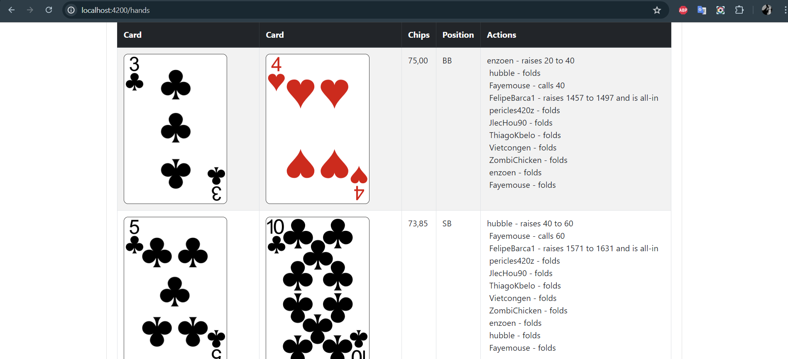

 

## General Information
- Full-Stack Application for parsing Poker Hands from a specific document to Java objects and display the values 
- The app shows the results of one player, but stores all the results of the whole hand as well
- The main logic is stored in a PositionGenerator class - where the program counts all the current players positions like they were sitting by a real table

## Technologies Used
- Java - version 17
- Spring Boot - 3.2.5
- Angular - 17.3.0

## Usage
 - The application runs on Localhost
 - Backend (localhost: 8080): run HandHistoryReplayerSpringApplication.java
 - Frontend (localhost: 4200): cd frontend folder | npm i | ng s --open
   (Node.js, Angular CLI needed)
 - Running app:  
1 - The user could upload the file (stored in resources/templates folder for trial purposes)  
2 - Click to the Hand button  
3 - The app shows the details of the Poker Hands  

## Room for improvement
 - Now works only for a hardcoded user

##

