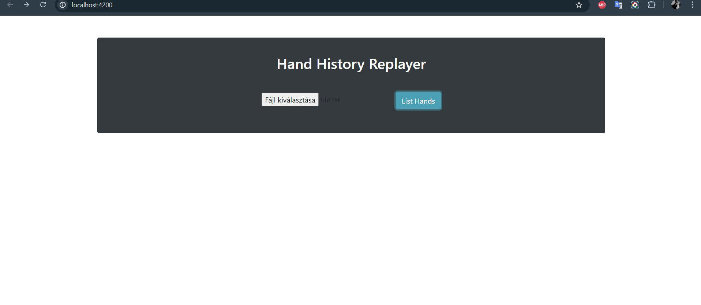

 

## General Information
- Application for parsing Poker Hands from document to Java objects, and display the values in HTML.
- The app shows the results of one player, but stores all the results of the whole hand as well
- The cards are shown with JPG images, further the current chips and all the actions are listed
- The main logic is stored in a PositionGenerator class - where the program counts all the current players positions like they were sitting by a real table

## Technologies Used
- Java - version 17
- Spring Boot - 3.2.5
- Angular - 17.3.0

## Usage
 - The application runs on Localhost
 - Backend (localhost: 8080): run HandHistoryReplayerSpringApplication.java
 - Frontend (localhost: 4200): cd frontend folder | npm i | ng s --open
   (Node.js, Angular CLI needed)
 

